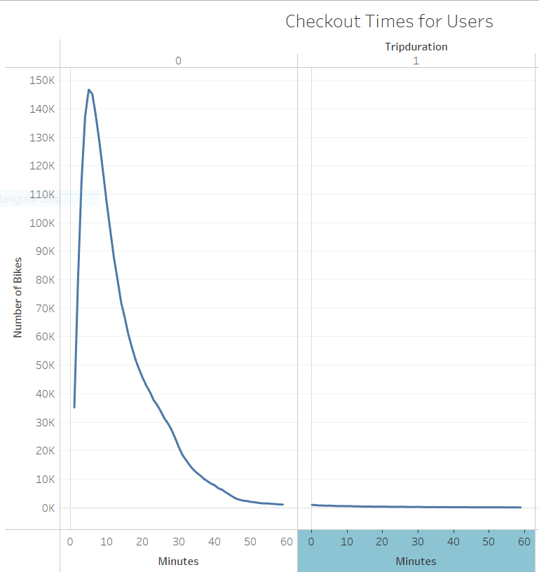
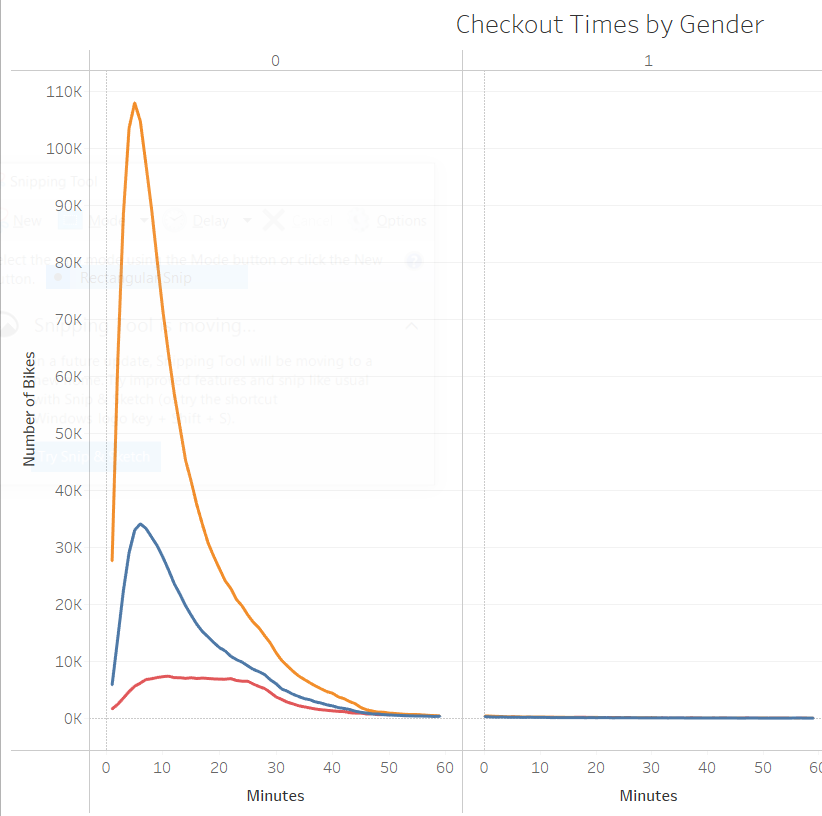
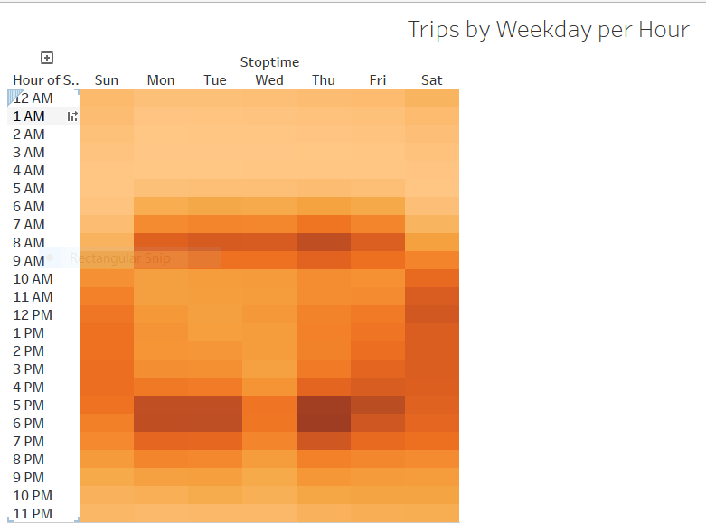
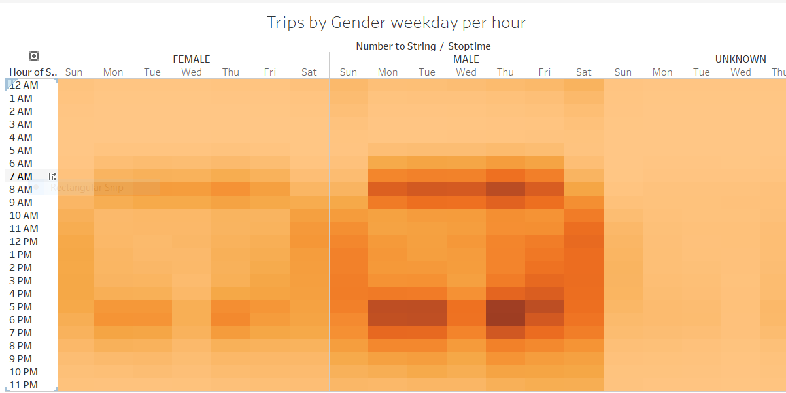
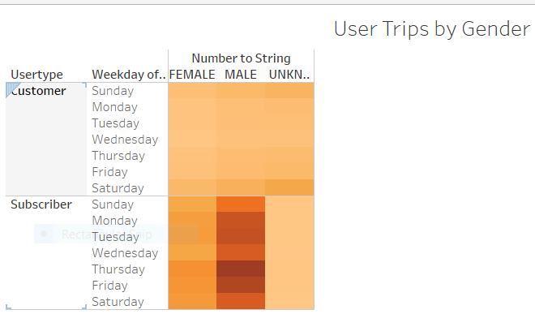

[link to dashboard](https://public.tableau.com/profile/agnieszka.blanchard#!/vizhome/Challenge14_16173741148170/Story1?publish=yes)

# NYC CitiBike Analysis

Overview:
In this challenge, NYC Bike sharing data is analyzed for stakeholders to determine if a bike sharing business opportunity would work in Des Moines.

## Resources:
Software:
* Tableau Public
* Jupyter Notebook

## Summary:
Questions answered:
1. How many minutes did the bike rent for?
2. Which gender rents out more bikes?
3. How many checkouts per each day and each hour? Which are busy times?
4. How many checkouts per each day, each hour and which gender?
5. How many checkouts by either customer or a subscriber? Gender?

## Answer 1.
Most bikes are rented for 5 minutes.  The range is from 5 min to 60 min. 

## Answer 2. 
Yellow line indicates Male. Blue line indicates Female. Red line indicates UNKNOWN.
Males rent out more bikes then females.  

## Answer 3. 
Most rentals occur at 8 am and between 5 pm and 6 pm , which would be rush hour.  

## Answer 4.
Most rentals occur at 8 am and between 5 pm and 6 pm, by Male.  
 
 
 
## Answer 5.
Most rentals occur by a Male Subscriber.  

